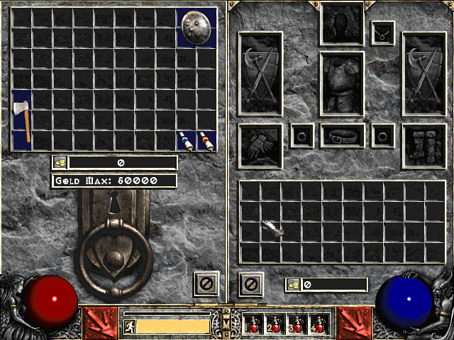

# cd2-7x10-stash
Expanded stash (70 slots) for Classic Diablo II v1.0-1.06

**Description:** Simple modification that expands available space for gear (stash only) to be used with older patch of Diablo II. Stash graphic was created using original assests, with clean design in mind.

**Usage:** Copy "data" directory into D2 root folder and launch via "-direct -txt". Only use on newly created characters.

**Credits:** Based on "Mega Inventory Kit" mod made by Fusman for [Phrozen Keep](https://d2mods.info/). Files were actually obtained from "Diablo 2++" mod by Rana Loreus, since original working version for old Classic Diablo II was nowhere be found. 

